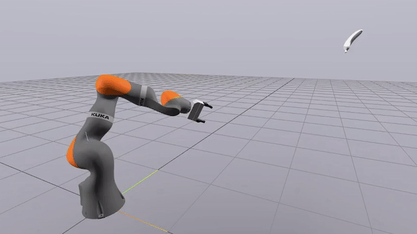

# Robotic Manipulation project

[A robot arm that catches bananas!](https://www.youtube.com/watch?v=TrhjG72PJNU) (using the [Drake](https://drake.mit.edu/) simulation environment, ICP, RANSAC, kinematic trajectory optimization, and much more).



## Installations
Our recommended setup requires using a Linux machine, or using WSL2 on Windows, with the following requirements:
- `python` 3.8 or higher
- `pip` 23.3.1 or higher

Necessary installs:
- `pip install manipulation`
- `pip install --extra-index-url https://drake-packages.csail.mit.edu/whl/nightly/ 'drake==0.0.20231210'` (or any newer version of drake)
- `pip install ipython`
- `pip install pyvirtualdisplay`

If you are running WSL on Windows, ensure you install the following to enable the graphics libraries to work:
 - Update to the latest version of WSL
 - `sudo apt install mesa-utils`
 - Install XcXsrv software on your Windows Machine: https://sourceforge.net/projects/vcxsrv/files/latest/download
 - Before running this code, start an instance of XcXsrv (by starting the XLaunch application). Leave all settings in XLaunch at the default, except, *disable Access Control*. You should only need to do this once (unless you kill XcXsrv or restart your machine).
 - Test that the display forwarding is working by runing `glxgears` in your WSL terminal. You should see a new window appear with an animation of spinning gears.
 - If you ever run src/main.py, but see nothing happen in the meshcat Window (but also receive no error message), you likely do not have an instance of XcXsrv running.

## Running
```
python src/main.py --obj ['t', 'b', or 'f'] --distance ['c' or 'f']
```

Additional Visualization can be turned on or off in the constructors of `GraspSelector` and `MotionPlanner` using the `self.visualize` variables.

## Discussion of Architecture
 - The program contains 3 core "systems":
    1. Object Ballistic Trajectory Estimator
    2. Grasp Selector
    3. Motion Planner
 - Each individual "system" is implemented as LeafSystem. These systems will all be added to the same diagram builder, which will link their inputs and outputs together.

## Future Work
 - Real time trajectory optimization: warm-starting the optimizer. While we do use the result of the previous traj opt as an initial guess for the next traj opt, we can go further to initialize the optimizer (SNOPT) with the same internal state between solves.
 - Single optimization for both catching a motion-planning: speed up the grasp pose selection and also remove constraints on how the object must be caught.

## Misc. Notes
 - `station.py` is a modified of `station.py` directly from drake. We imported it so that we could modify it such that we can export the `desired_acceleration` input port and also so that we could modify the PID gains of the WSG gripper.
 - In the SDF file of the object to be caught, the origin in the SDF file MUST roughly be at the object's centroid.